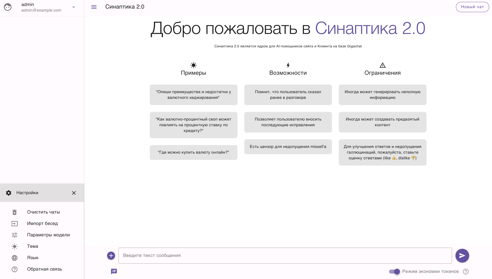

<div align="center">
<h1> AI-помощник Ya Chat </h1>
</div>

Проект, проходящий тест Тьюринга, в виде AI-помощника **YaChat**[^1] на базе большой языковой модели (LLM). 

```text
< PROJECT ROOT >
    |
    |-- .github/                                # Конфигурации для GitHub Actions и другие настройки репозитория (CI/CD и шаблоны GitHub)
    |   |-- FUNDING.yml                         # Краудфандинг для поддержки проекта 
    |   |-- workflows/                          # GitHub Actions
    |       |-- docker-image.yml                # Сборка Docker-образов
    |       |-- docker-image-static.yml         # Добавляет Dockerfile и workflow для сборки Docker-образа, предназначенного для статического хостинга (скорее всего, Nginx или подобного)
    |       |-- docs.yml                        # TBD
    |
    |-- components/                             # Vue 3 компоненты интерфейса
    |   |-- settings                            # Дополнительные настройки
    |       |-- Languages.vue                   # Настройки выбора языка
    |   |-- ApiKeyDialog.vue                    # Реализует модальное окно для ввода и сохранения API-ключа OpenAI в интерфейсе веб-приложения
    |   |-- ChatInput.vue                       # Визуализация потока сообщений между пользователем и AI
    |   |-- DocumentsManage.vue                 # Управлениe документами, которые могут использоваться в рамках взаимодействия с AI, например, для загрузки, просмотра и удаления файлов, используемых для контекстного анализа или RAG
    |   |-- MessageActions.vue                  # Отображение и обработку действий, которые можно выполнить с отдельным сообщением в чате. Он используется внутри Conversation.vue
    |   |-- ModelDialog.vue                     # Модальное окно для выбора и настройки модели AI, используемой в чате 
    |   |-- ModelParameters.client.vue          # Параметры генерации ответов для выбранной модели (используется внутри ModelDialog.vue)
    |   |-- MsgContent.vue                      # Отображение содержимого отдельного сообщения в чате. Он используется внутри Conversation.vue
    |   |-- MsgEditor.vue                       # Oтвечает за интерфейс редактирования и ввода сообщений в чате. Обычно он используется напрямую внутри Conversation.vue
    |   |-- NavigationDrawer.vue                # Pеализует боковую панель навигации (drawer)
    |   |-- Prompt.vue                          # Oтображение и управление пользовательскими подсказками (prompts) в интерфейсе чата
    |   |-- Welcome.vue                         # Oтображение приветственного экрана
    |   |-- WelcomeCard.vue                     # используется внутри Welcome.vue для отображения отдельных карточек с приветственной информацией, подсказками или примерами использования приложения
    |
    |-- composables/                            # Nuxt composables (состояние, API-запросы)
    |   |-- fetch.js                            # Hужен для централизованного управления запросами к серверу в приложении
    |   |-- states.js                           # Используется для централизованного хранения реактивных состояний приложения
    |
    |-- demos/                                  # Демонстрации возможностей
    |   |-- ...                                 # ...
    |
    |-- docs/                                   # Документация проекта 
    |   |-- ...                                 # ...
    |
    |-- lang/                                   # Поддержка языков
    |   |-- ...                                 # ...
    |
    |-- layouts/                                # Nuxt-папкa для хранения макетов (layouts)
    |   |-- default.vue                         # Oсновного макет приложения
    |   |-- vuetifyApp.vue                      # инициализации Vuetify в приложении Nuxt 3. Vuetify — это UI-фреймворк на основе Material Design, и в Nuxt 3 для него создают отдельный корневой компонент, чтобы подключить плагин и настроить темы
    |
    |-- middleware/                             # Используется для промежуточной логики, которая выполняется перед загрузкой страницы. В проекте она выполняет классические задачи вроде проверки авторизации, редиректов и других условий доступа
    |   |-- auth.ts                             # Mодуль для работы с авторизацией (проверяет, авторизован ли пользователь, и при необходимости перенаправляет на страницу входа (/account/signin))
    |
    |-- pages/                                  # Kомпоненты страниц, на которые фреймворк автоматически создаёт маршруты
    |   |-- index.vue                           # Главная страница
    |   |-- account/                            # Cтраницы, связанные с авторизацией и управлением аккаунтом пользователя
    |      |-- ...                              # ...
    |
    |-- plugins/                                # Инициализации сторонних библиотек и плагинов
    |   |-- ...                                 # ...
    |
    |-- public/                                 # Статические файлы (иконки, etc)
    |   |-- ...                                 # ...
    |
    |-- server/                                 # Здесь находятся middleware для обработки запросов на сервере. Пример задач: проверка авторизации по токену; логирование запросов, etc
    |   |-- middleware/                         # Серверное middleware
    |       |-- apiProxy.ts                     # Server middleware в Nuxt 3, который использует http-proxy-middleware для проксирования (процесс, когда один сервер или middleware принимает запрос от клиента и перенаправляет его на другой сервер, а затем возвращает ответ обратно клиенту) запросов к API
    |
    |-- utils/                                  # Используется для вспомогательных функций и утилит, которые не являются компонентами или composables, но нужны для работы приложения
    |   |-- ...                                 # ...
    |
    |-- app.vue                                 # Корневой компонент
    |-- db.sqlite3                              # БД
    |-- deployment.sh                           # Скрипт деплоя
    |-- docker-compose.yml                      # Определение и управления многоконтейнерными приложениями в Docker
    |-- Dockerfile                              # Набор инструкций для создания образа Docker. Каждая инструкция в Dockerfile создает слой в образе, и при сборке образа Docker выполняет эти инструкции последовательно
    |-- LICENSE                                 # Лицензия MIT
    |-- nginx.conf                              # Основной конфигурационный файл для веб-сервера Nginx
    |-- nuxt.config.ts                          # Используется для настройки приложения на основе Nuxt.js, фреймворка для создания универсальных приложений на Vue.js
    |-- package.json                            # Mетаданные о проекте, а также информацию о зависимостях, скриптах и других настройках
    |-- README.md                               # Описание проекта
    |-- tsconfig.json                           # Настройки TypeScript
    |-- yarn.lock                               # Снимок зависимостей
    |
    |-- ************************************************************************
```

<br />

Launch: 

```bash
# Move to directory with docker-compose.yml
cd /your/directory/with/code

# Up docker for launch app
docker-compose up --pull always -d
```

For editing docker containers: 

```bash
# Move to directory with docker-compose.yml
cd /your/directory/with/code

# Check existing images
docker images

# Load container
docker-compose up --pull always -d

# OR delete old images
docker rmi yourname

# Re-build your images (avg time ~ 913 seconds = 15.2 minutes)
start_time=$(date +%s)  # Запоминаем текущее время в секундах
docker-compose down

docker-compose up --pull always -d # Выполняем команду
end_time=$(date +%s)    # Запоминаем время окончания
execution_time=$((end_time - start_time))  # Вычисляем время выполнения
echo "Время выполнения: $execution_time секунд" # Выводим инфо
```

Connect Gigachat

Create file .env with access settings to GigaChat API:

   ```sh
   GIGACHAT_CREDENTIALS=ключ_авторизации
   GIGACHAT_BASE_URL=...
   ```


[^1]: _yet another chat_

Скриншот запущенного сервиса:



Видео демо:

https://user-images.githubusercontent.com/46235412/227156264-ca17ab17-999b-414f-ab06-3f75b5235bfe.mp4

